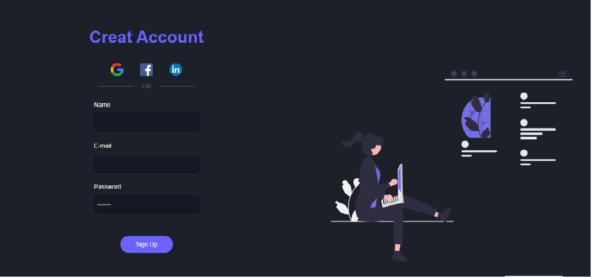

#Pagina-de-login-Responsiva

>  Project in Html & CSS & Responsive

Página de criação de conta, com link de redes sociais, e inputs para preenchimentos de dados. Com responsividade para acesso a vários tipos de dispositivos.

> Imagem do resultado do projeto da Página

## 🚀 Technologies

Esse projeto foi desenvolvido com as seguintes tecnologias:

- HTML5
- CSS3
- Responsividade

## 🤝 Colaboradores

Agradecemos às seguintes pessoas que contribuíram para este projeto:

<table>
  <tr>
    <td align="center">
      <a href="#">
         
        
          <b>Zenith Carla</b>
        
      </a>
    </td>
    </tr>
</table>

[⬆ Voltar ao topo](#Pagina-de-login-Responsiva) 
